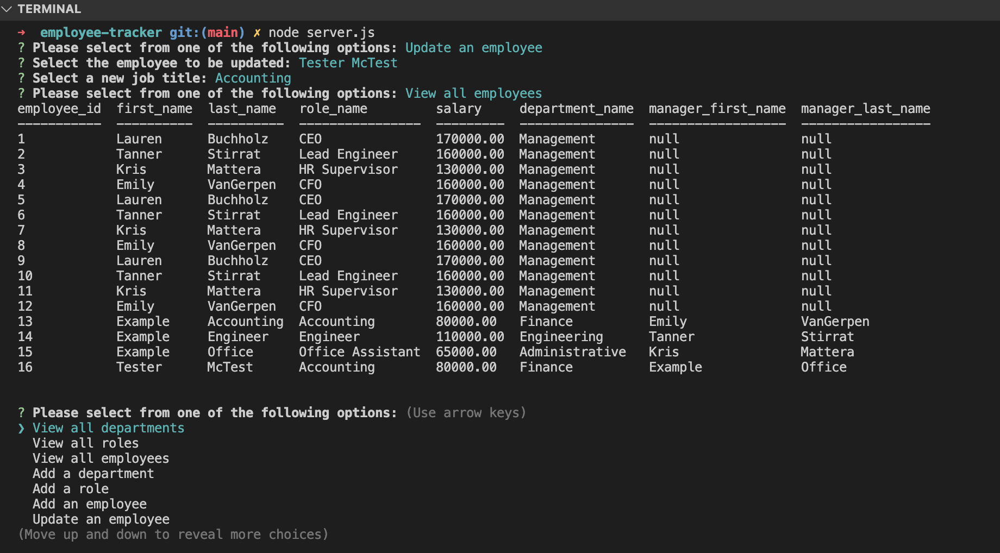

# Employee-Tracker

## Bootcamp homework

A business owner requires a content management system to view and manage departments, roles, and employees within their company. The following "Acceptance Criteria" for this feature were requested and have now been implemented:

- A command-line application was created which accepts user input
- Responses generated by the command-line application connect with and return a SQL database containing the following (when specifically prompted for each via an interactive menu):
  - A table with company department information
  - A table with company role information, including salaries and associated departments
  - A table with company employee information, including job titles, associated departments, salaries, and reporting managers (if applicable)
- The command-line application also provides users with the opportunity to:
  - Add a department to the Departments table
  - Add a role to the Roles table
  - Add or update an employee in the Employees table

Additionally, a video walk-through highlighting the program's functionality has been created and linked (below), and the Javascript includes comments.

## Employee Tracker -- File screenshot

The following is a screenshot of the command-line interface, highlighting the program's appearance and functionality:

## Link to video walk-through:

As the employee tracker cannot be deployed at a live URL, a video highlighting a walk-through of using this application is included here: https://drive.google.com/file/d/1vY99GqzNHrA41b8aoqa1yq9Tb1r7Uvrj/view?usp=sharing
